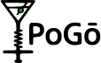
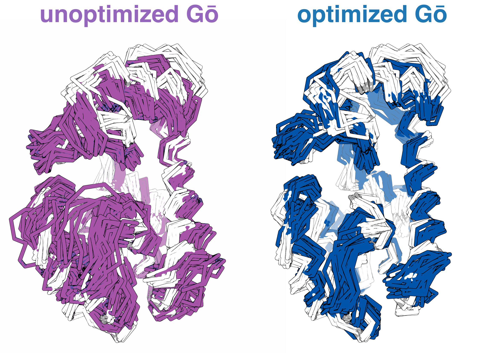
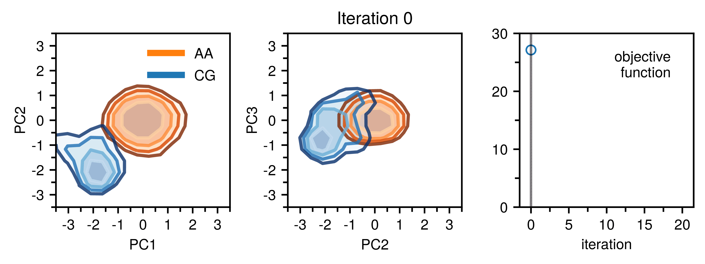
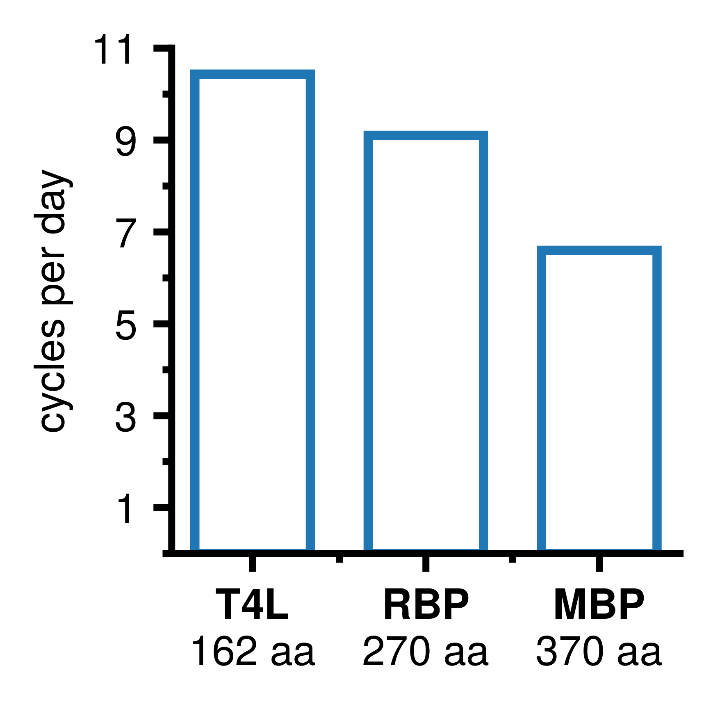

[]()
[]()
[]()
# Perturbation-based optimization for GōMartini (PoGō)

<p align="center">
  
</p>

**P**erturbation-based **o**ptimization for **Gō**Martini (PoGō for short) is a toolkit for optimizing GōMartini protein models using perturbation theory and particle swarm optimization (PSO) to reproduce more accurate structural ensembles.  

It implements the method described in:  

> **Kalutskii, M., Wilson, C. J., Grubmüller, H., & Igaev, M. (2025).**  
> *Improving conformational ensembles of folded proteins in GōMartini.*  
> Max Planck Institute for Multidisciplinary Sciences & University of Dundee.

---

## What is PoGō?

Martini 3 is one of the most widely used coarse-grained (CG) force fields; however, standard elastic network (ENM) and Gō models struggle to capture essential protein dynamics.

<p align="center">
  
</p>

Without manual tuning, **PoGō** iteratively refines an initial non-uniform GōMartini interaction network to reproduce a reference atomistic free energy landscape in the essential subspace; the result is a coarse-grained forcefield that reproduces a more physically realistic ensemble.  

<p align="center">
  
</p>

[comment]: <> (<p align="center">)
[comment]: <> (  )
[comment]: <> (</p>)

---

## Usage
### Requirements
- **Python 3.9+**
- **GROMACS 2021+**
- Python dependencies:
  ```bash
  pip install numpy pandas matplotlib MDAnalysis scipy numba
  ```

### Required inputs
- Forward mapped reference structure, trajectory, and index file with backbone bead indices for fitting (e.g., `example/reference[.pdb,.xtc,.ndx]`)
- Martini system topology and Gō network created using `martinize2` (e.g., `example/topology/`)
- Initial configuration(s) for ensemble generation simulations (e.g., `example/initial/`)

### Generation and Optimization
Optimization proceeds in two steps:

1. a coarse-grained ensemble is generated `src/generate.py` and
2. the optimal perturbation to the Gō network is determined `src/optimize.py`. This cycle is repeated until convergence.

an example for T4 lysozyme with all relevant inputs is provided in `example/`.

---

## 🚀 Performance
<p>
  

  Using an **M4 MacBook Air** (GROMACS 2025) with our recommended setup of 1 μs CG-simulation per cycle (_i.e._ 10 × (150 ns – 50 ns)), we achieve roughly **10**, **9**, and **7** optimization cycles per day for **T4 lysozyme (T4L)**, **ribose binding protein (RBP)**, and **maltose binding protein (MBP)**, respectively.  

  Given a typical convergence time of around 20 cycles, this suggests that **a few days** are sufficient to yield an optimized Gō network using **only a laptop**.
</p>

## Citation
If you are using our code please cite the following paper:
```bibtex
@article{pogo2025,
  title={Improving conformational ensembles of folded proteins in GōMartini},
  author={Kalutskii, Maksim and Wilson, Carter J. and Grubmüller, Helmut and Igaev, Maxim},
  journal={bioRxiv},
  year={2025},
  doi={10.1126}
}
```

## Get in touch
If you have any questions please create an issue or contact the corresponding author on our [preprint](https://doi.org/).
